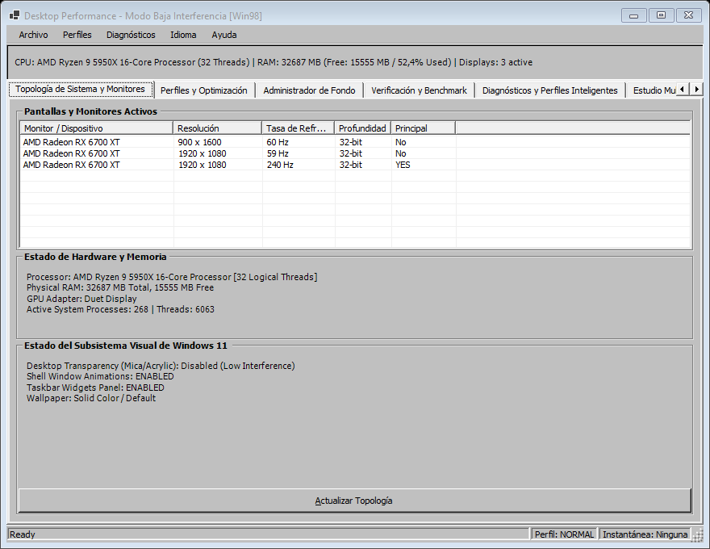
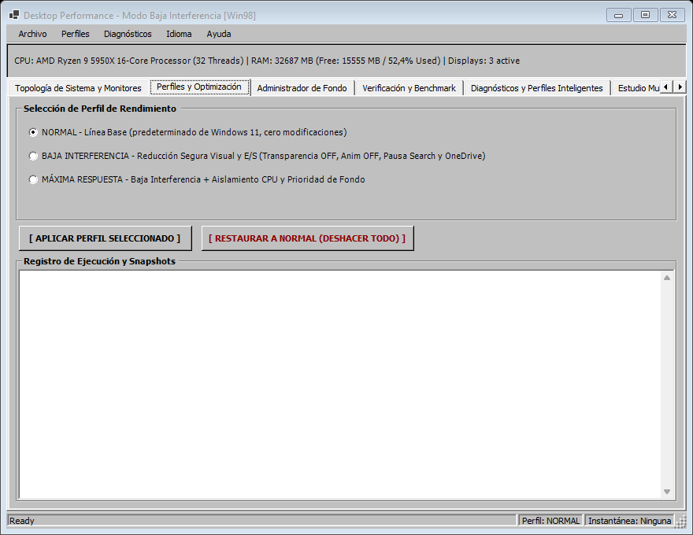
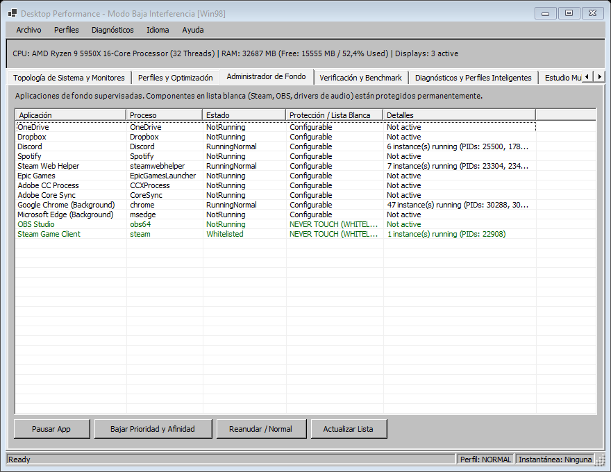
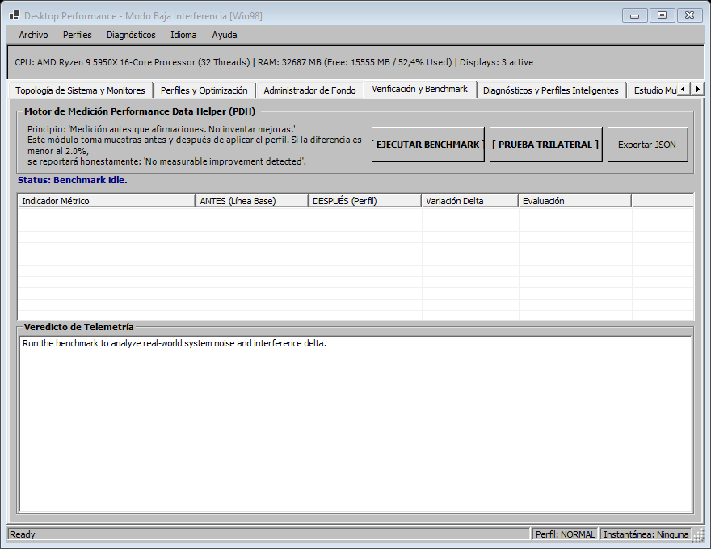
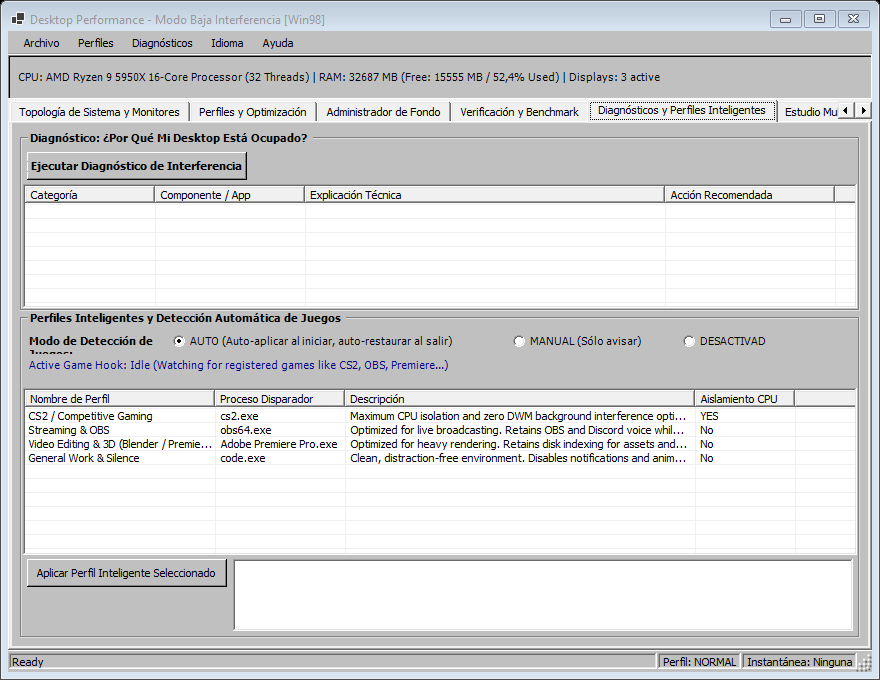
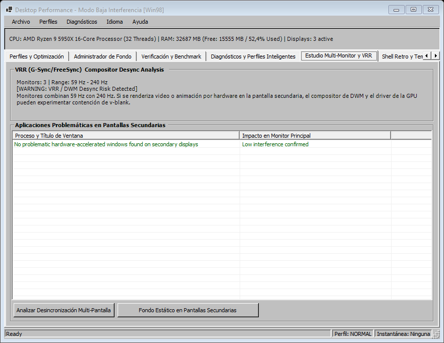
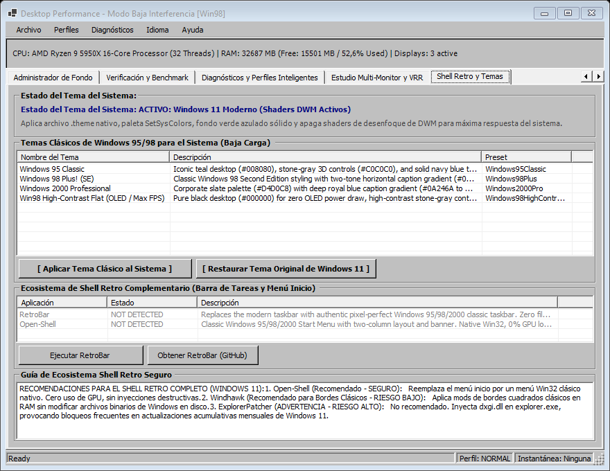

# ZeroLatency98: Suite de Rendimiento y Tema Clásico para Windows 11

> **Mantener Windows 11 moderno y funcional, pero hacer que el desktop sea lo más estático, simple y poco intrusivo posible cuando se necesita máxima capacidad de respuesta del sistema.**

[](https://github.com/rapabru/ZeroLatency98/releases/latest)
[](LICENSE)
[]()
[]()

🌐 **[Read this documentation in English (README.md)](README.md)**

Una herramienta de precisión para Windows 11 diseñada bajo los principios de **latencia mínima, reversibilidad estricta y reducción medible de interferencias del sistema operativo**, encapsulada en una interfaz clásica y ligera inspirada en **Windows 95/98/2000**.

---

### ⬇️ [Descargar la última versión (v1.5.0)](https://github.com/rapabru/ZeroLatency98/releases/latest)

- **Standalone x64 (`ZeroLatency98-v1.5.0-win-x64-standalone.zip`):** Un único archivo ejecutable autónomo. No requiere instalar runtimes ni dependencias. Descargar, descomprimir y ejecutar directamente en Windows 11 x64.
- **Portátil Ligero (`ZeroLatency98-v1.5.0-portable.zip`):** Paquete ultraligero (requiere .NET 9 Desktop Runtime instalado).

---

## 📸 Galería de Interfaz

### Administrador de Procesos de Fondo y Ordenamiento por Columnas
La interfaz permite pausar, reanudar y asignar prioridad de fondo a procesos pesados con ordenamiento interactivo en todas sus columnas (`▲` / `▼`):


*Vista en ejecución: Detección y ordenamiento interactivo de procesos con estadísticas de consumo, threads y memoria en tiempo real.*

---

### Módulos del Sistema (7 Pestañas Especializadas)

| Pestaña | Captura de Pantalla | Descripción |
|---|---|---|
| **1. Topología del Sistema** |  | Inspección de monitores, resolución, tasa de refresco (Hz), DPI y estado de composición DWM. |
| **2. Perfiles y Optimización** |  | Conmutación instantánea entre perfiles *Normal*, *Baja Interferencia* y *Máxima Respuesta*. |
| **3. Administrador de Fondo** |  | Control granular de aplicaciones secundarias (Chrome, Discord, Steam, Spotify, OneDrive). |
| **4. Verificación y Benchmark** |  | Medición Trilateral automatizada (Antes vs Después vs Delta) con contadores de rendimiento PDH. |
| **5. Diagnósticos y Perfiles Inteligentes** |  | Detección de procesos intrusivos ("¿Por qué está ocupado el sistema?") y auto-activación por juegos. |
| **6. Estudio Multi-Monitor & VRR** |  | Prevención de desincronización de G-Sync/FreeSync y microstuttering por aceleración en pantallas secundarias. |
| **7. Tema Clásico y Shell Retro (Fase 5)** |  | Activador de Tema Clásico Windows 95/98 para todo el sistema. Aplica archivos .theme nativos, paleta SetSysColors, fondo teal sólido y apaga shaders DWM para mínima sobrecarga gráfica. |

---

## 🪟 Fase 5: Motor de Tema Clásico Windows 95/98 del Sistema (Cero Sobrecarga)

Windows 10 y 11 imponen una fuerte sobrecarga gráfica a través del compositor DWM: efectos Mica y Acrílico en tiempo real, sombras proyectadas y animaciones que consumen ciclos de GPU y aumentan la latencia en gaming competitivo y producción de audio en tiempo real.

### Cómo Aplica la Fase 5 el Tema Clásico de Forma Segura:
A diferencia de herramientas obsoletas y peligrosas que parchaban o inyectaban `uxtheme.dll` o `dwm.exe` (provocando pantallazos negros o bloqueos tras las actualizaciones de Windows), esta suite utiliza **métodos 100% nativos, estables y reversibles**:

1. **Generación Dinámica de Archivos `.theme`:** Escribe archivos de tema compatibles en `%LOCALAPPDATA%\DesktopPerformance98\Themes\`:
   - **Windows 95 Clásico:** Fondo verde azulado (`#008080`), controles 3D gris piedra (`#C0C0C0`) y barras de título azul marino sólido (`#000080`).
   - **Windows 98 Plus! (SE):** Gradiente horizontal clásico de dos tonos en barra de título (`#000080` a `#1084D0`) y fondo teal.
   - **Windows 2000 Professional:** Paleta pizarra corporativa (`#D4D0C8`) con gradiente azul real (`#0A246A` a `#A6CAF0`).
   - **Win98 High-Contrast Flat (OLED / Máximo FPS):** Fondo negro puro (`#000000`) para consumo cero en pantallas OLED y mínima latencia de composición.
2. **Inyección en Memoria con `SetSysColors`:** Aplica más de 25 índices de color de la interfaz de forma inmediata para que las ventanas abiertas y cuadros de diálogo adopten el aspecto clásico sin reiniciar la sesión.
3. **Escritorio Plano Teal (`#008080`):** Elimina texturas pesadas de la memoria de video y establece el fondo sólido icónico vía `SystemParametersInfo(SPI_SETDESKWALLPAPER)`.
4. **Supresión de Shaders y Animaciones DWM:** Apaga transparencia, animaciones de minimizado/maximizado (`SPI_SETANIMATION`) y sombras proyectadas.
5. **Rollback Atómico en 1 Clic:** Realiza una copia de seguridad automática del tema actual de Windows 11 (`backup_theme.theme`) y ofrece el botón **[ Restaurar Tema Original de Windows 11 ]**.
6. **Ecosistema de Shell Retro Complementario:** Escanea y permite ejecutar con un clic herramientas no invasivas de código abierto (**RetroBar** para la barra de tareas y **Open-Shell** para el menú inicio).

## 🌐 Soporte Multilingüe Integrado (Español / Inglés)

El programa incluye soporte completo para **Inglés y Español** en un único ejecutable:
- Se cambia instantáneamente en caliente desde la barra de menú: **Idioma / Language** ➔ **English (US)** / **Español**.
- Detecta automáticamente el idioma de tu sistema operativo al iniciar por primera vez.
- Guarda tu preferencia en `%LOCALAPPDATA%\DesktopPerformance98\language.txt`.
- No requiere reiniciar la aplicación ni descargar paquetes adicionales.

---

## 🎯 Filosofía y Principios Técnicos

El propósito de esta aplicación **NO es "ahorrar RAM" ni aplicar placebos agresivos**. Su objetivo es suprimir la contención silenciosa del sistema operativo que degrada la estabilidad de fotogramas y la latencia en tareas de alta exigencia (gaming competitivo, producción de audio digital DAW, streaming y renderizado):

- **Reducción de DWM Workload:** Desactiva efectos de transparencia (Mica/Acrylic) y animaciones innecesarias de ventanas.
- **Mitigación de CPU Wakeups:** Reduce la actividad de temporizadores y cambios de contexto innecesarios en segundo plano.
- **Aislamiento Multi-Monitor:** Evita que navegadores y reproductores en monitores secundarios degraden el refresco variable (VRR/G-Sync) del monitor principal.
- **Supresión de I/O de Fondo:** Pausa ordenadamente indexadores (Windows Search) y sincronizadores (OneDrive).
- **Cero Placebos:** Sin pseudo-limpiadores de memoria (`EmptyWorkingSet`), sin alterar Windows Defender, sin scripts de "debloat" destructivos.
- **Huella Mínima de la Herramienta:** Menos de 10 MB de memoria RAM, 0% de uso de CPU en reposo y cero consumo de GPU (GDI puro).

---

## 🚦 Clasificación de Intervenciones y Seguridad

| Categoría | Modificaciones Incluidas | Nivel de Riesgo |
|---|---|---|
| **SAFE** | Transparencia OFF, Animaciones OFF, Wallpaper estático, Ocultar Widgets, Pausar Windows Search Indexer, Prioridad `PROCESS_MODE_BACKGROUND_BEGIN`. | Ninguno. Totalmente reversible y soportado por APIs nativas de Microsoft. |
| **LOW RISK** | Pausar OneDrive/Dropbox, aislar afinidad de CPU para procesos de fondo, suspender apps de chat secundarias. | Bajo. Totalmente reversible al restaurar el perfil o al salir de la aplicación. |
| **MEDIUM RISK** | Supresión temporal de suites RGB/periféricos pesadas que bloquean temporizadores del kernel. | Medio. El hardware opera con sus perfiles de memoria onboard. |
| **DO NOT TOUCH** | Matar `dwm.exe`, "RAM cleaners" destructivos, desactivar Defender, tocar BCD/HPET/Core Parking global. | **Prohibido.** Inestable o contraproducente. |

---

## 📊 Medición y Verificación Objetiva

La aplicación incluye un motor de telemetría de rendimiento basado en la API nativa **PDH (Performance Data Helper)** de Windows:

- **Context Switches/sec:** Mide la contención del planificador del procesador y la alternancia de hilos.
- **GPU Engine (DWM DirectComposition):** Evalúa el porcentaje real de GPU dedicado al compositor de ventanas.
- **Disk I/O Bytes/sec:** Supervisa la actividad de almacenamiento del indexador y procesos en segundo plano.
- **CPU Time %:** Carga global de procesamiento.

> **Principio de Honestidad:** Si una optimización produce un delta inferior al 2%, el sistema lo reportará con total transparencia: *"No measurable improvement detected"*.

---

## 🚀 Inicio Rápido y Compilación

### Ejecución Directa
1. Descarga el archivo zip desde [Releases](https://github.com/rapabru/theme-98/releases/latest).
2. Extrae el contenido en cualquier carpeta.
3. Ejecuta `ZeroLatency98.exe`.

### Compilación desde el Código Fuente
Requiere [.NET 9 SDK](https://dotnet.microsoft.com/download/dotnet/9.0):

```powershell
# Clonar el repositorio
git clone https://github.com/rapabru/ZeroLatency98.git
cd ZeroLatency98

# Ejecutar las pruebas unitarias (27 pruebas superadas)
dotnet test

# Ejecutar en modo desarrollo
.\run.bat

# Publicar ejecutable standalone x64
dotnet publish src/DesktopPerformance -c Release -r win-x64 --self-contained true -p:PublishSingleFile=true
```

---

## 🛡️ Principios Inviolables de Desarrollo

1. **Seguridad antes que rendimiento.**
2. **Reversibilidad antes que agresividad (Rollback atómico transaccional garantizado).**
3. **Medición antes que afirmaciones (Telemetry-driven con verificación PDH).**
4. **Cero placebos (Sin vaciado falso de RAM ni tweaks destructivos de registro).**
5. **No romper componentes de Windows ni antivirus.**
6. **La propia herramienta consume < 10 MB de RAM y 0% de CPU en reposo.**

---

## 📄 Licencia

Este proyecto está bajo la Licencia MIT. Consulta el archivo [LICENSE](LICENSE) para más detalles.
