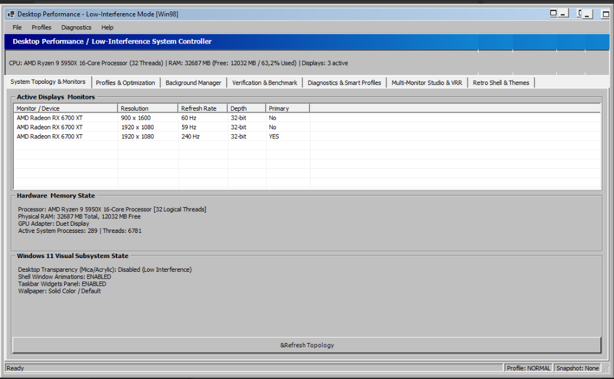
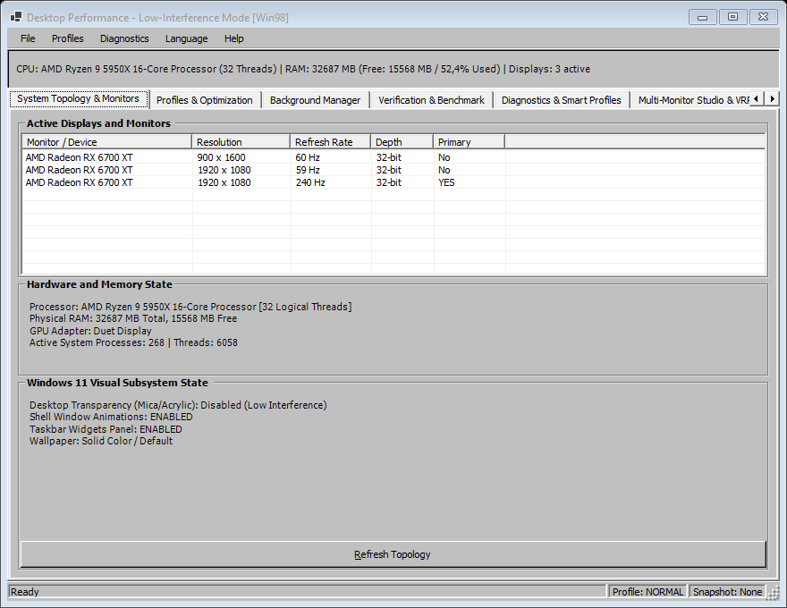
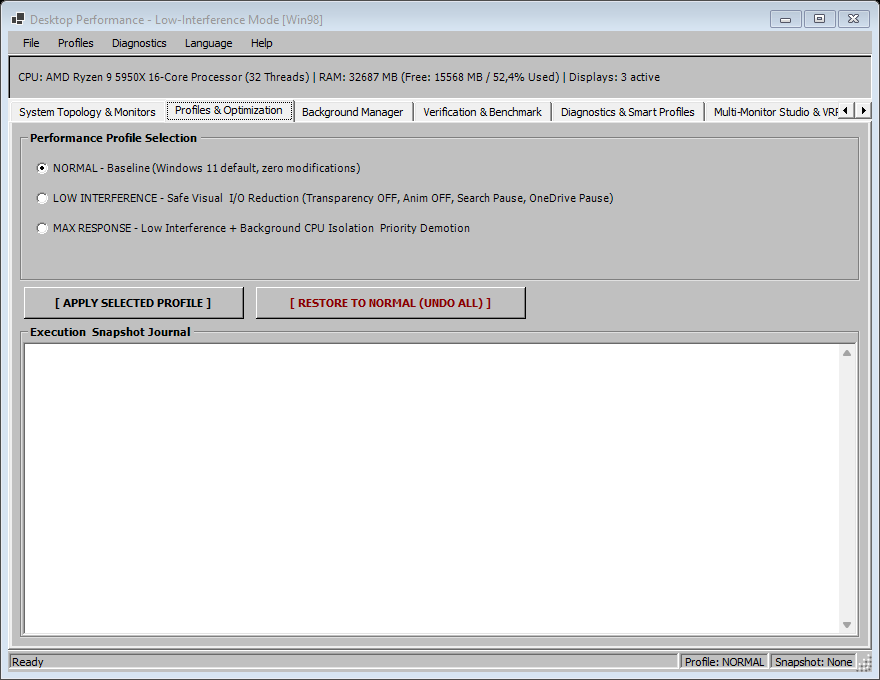
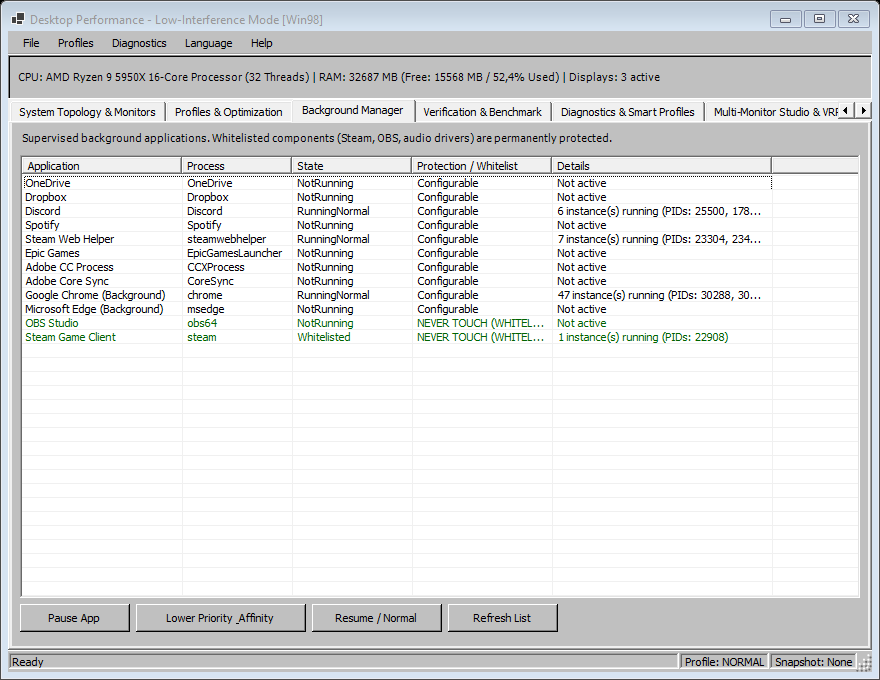
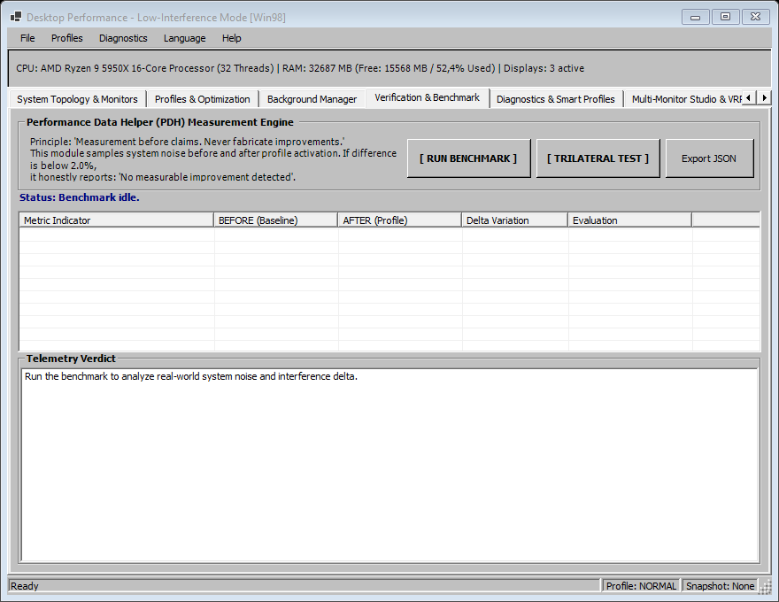
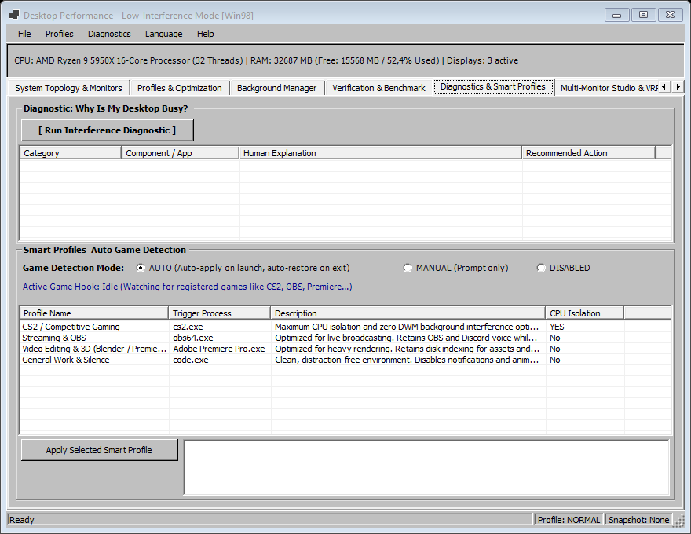
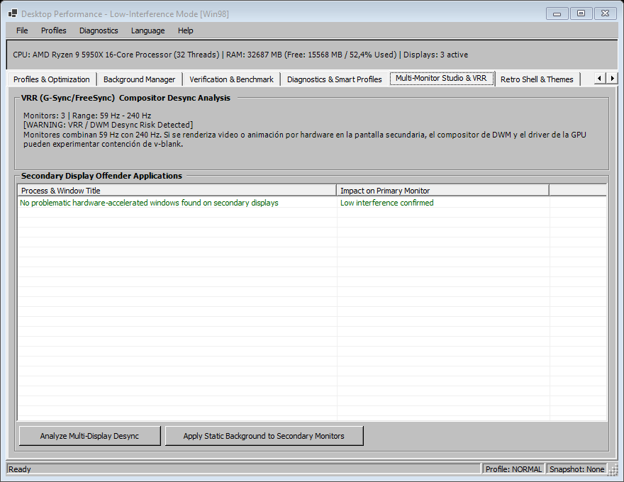
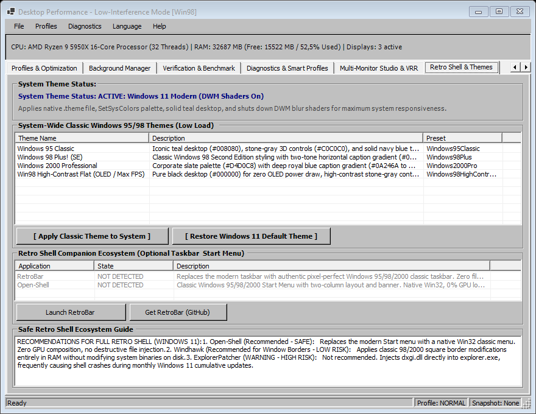

# ZeroLatency98: Windows 11 Latency & Classic Theme Suite

> **Keep Windows 11 modern and fully functional, but make the desktop as static, simple, and non-intrusive as possible when maximum system responsiveness is demanded.**

[](https://github.com/rapabru/ZeroLatency98/releases/latest)
[](LICENSE)
[]()
[]()
[]()

🌐 **[Leer esta documentación en Español (README.es.md)](README.es.md)**

A precision latency-reduction and interference-mitigation tool for Windows 11, engineered strictly around **zero-placebo optimization, atomic reversibility, and verifiable telemetry**, wrapped in an ultra-lightweight classic **Windows 95/98/2000** user interface.

---

### ⬇️ [Download the Latest Release (v1.5.0)](https://github.com/rapabru/ZeroLatency98/releases/latest)

- **Standalone x64 (`ZeroLatency98-v1.5.0-win-x64-standalone.zip`):** Single, self-contained executable. No runtime installations or external dependencies required. Download, extract, and run directly on Windows 11 x64.
- **Lightweight Portable (`ZeroLatency98-v1.5.0-portable.zip`):** Ultra-small ~600 KB package (requires .NET 9 Desktop Runtime).

---

## 📸 Interface Showcase

### Background Process Supervisor & Interactive Column Sorting
Monitor and manage secondary applications (Discord, Chrome, Steam, Spotify, OneDrive) with live sorting across all columns (`▲` / `▼` sort glyphs):


*Live execution: Real-time telemetry, thread count, working set memory, and granular process state control (Pause, Resume, Background Eco Priority).*

---

### System Modules (7 Specialized Tabs)

| Module | Interface Preview | Technical Purpose |
|---|---|---|
| **1. System Topology & Monitors** |  | Inspect displays, resolutions, refresh rates (Hz), DPI scaling, and active DWM hardware composition state. |
| **2. Profiles & Optimization** |  | Instant switching between *Normal*, *Low-Interference*, and *Maximum Responsiveness* profiles with transactional JSON rollback snapshots. |
| **3. Background Manager** |  | Granular process supervision with `NtSuspendProcess` pausing and `PROCESS_MODE_BACKGROUND_BEGIN` Eco priority scheduling. |
| **4. Verification & Benchmark** |  | Automated Trilateral Benchmark (Baseline vs Optimized vs Delta) using native Windows PDH telemetry counters. |
| **5. Diagnostics & Smart Profiles** |  | *"Why is system busy?"* deep analysis, signature database, and background game watcher for automatic profile engagement. |
| **6. Multi-Monitor Studio & VRR** |  | Mitigates VRR/G-Sync de-synchronization and frame pacing jitter caused by hardware-accelerated apps on secondary displays. |
| **7. Classic Theme & Retro Shell (Phase 5)** |  | System-wide Windows 95/98 Classic Theme enabler. Applies native .theme files, SetSysColors palette, solid teal desktop, and eliminates DWM blur shaders for lowest GPU overhead. |

---

## 🪟 Phase 5: System-Wide Windows 95/98 Classic Theme & Zero-Overhead Engine

Modern Windows 10 and 11 force heavy GPU-driven DWM composition: real-time Mica and Acrylic blur shaders, drop shadows, and window animations that consume VRAM and can cause frame pacing stutter in competitive gaming or real-time audio production.

### How Phase 5 Applies the Classic Theme Safely:
Unlike obsolete and dangerous patchers that modify `uxtheme.dll` or inject code into `dwm.exe` (which break with Windows Updates and can cause boot loops), this tool strictly adheres to **100% native, supported, and reversible mechanisms**:

1. **Dynamic `.theme` Generation:** Generates authentic `.theme` definitions saved to `%LOCALAPPDATA%\DesktopPerformance98\Themes\`:
   - **Windows 95 Classic:** Teal desktop (`#008080`), stone-gray 3D controls (`#C0C0C0`), and solid navy blue title bars (`#000080`).
   - **Windows 98 Plus! (SE):** Classic two-tone caption gradient (`#000080` to `#1084D0`) with teal desktop.
   - **Windows 2000 Professional:** Corporate slate palette (`#D4D0C8`) with deep blue gradient (`#0A246A` to `#A6CAF0`).
   - **Win98 High-Contrast Flat (OLED / Max FPS):** Pure black background (`#000000`) for zero-power draw on OLED monitors and lowest DWM composition latency.
2. **Immediate In-Memory `SetSysColors`:** Reconfigures 25+ classic Win32 color indices in memory instantly via official User32 APIs, updating open dialogs and classic windows without requiring a system restart.
3. **Solid Teal Desktop (`#008080`):** Removes heavy wallpaper textures from GPU memory and sets the classic solid color via `SystemParametersInfo(SPI_SETDESKWALLPAPER)`.
4. **DWM Shaders & Animation Suppression:** Automatically turns off transparency, window animations (`SPI_SETANIMATION`), and drop shadows to minimize compositor workload.
5. **Atomic 1-Click Rollback:** Automatically backs up your active Windows 11 theme (`backup_theme.theme`) before applying and provides an instant **[ Restore Windows 11 Default Theme ]** button.
6. **Companion Retro Shell Integration:** Built-in scanner and one-click launcher for safe, non-invasive open-source companion tools (**RetroBar** for the taskbar and **Open-Shell** for the Start menu).

## 🌐 Dynamic In-App Multilingual Engine (English / Español)

This application includes seamless, single-binary support for both **English** and **Spanish**:
- Switch languages on the fly directly from the menu bar: **Language** ➔ **English (US)** / **Español**.
- Dynamically updates all controls, menu items, column headers, dialogs, and status labels without restarting the app.
- Preserves active column sort glyphs (`▲`/`▼`) across language transitions.
- Automatically detects the Windows OS language (`CultureInfo.CurrentUICulture`) on first launch.
- Persists user language preference to `%LOCALAPPDATA%\DesktopPerformance98\language.txt`.
- Strictly implemented as a single, unified executable—never split into separate language builds.

---

## 🎯 Technical Philosophy & Zero-Placebo Invariant

Most "Windows optimization" tools rely on aggressive placebos or harmful system modifications:
- **No Pseudo-RAM Cleaners:** Invoking `EmptyWorkingSet()` artificially dumps process pages into the pagefile, causing immediate disk thrashing and hard page faults when those processes need their working set back.
- **No Tampering with Windows Defender:** We never disable security mechanisms, anti-malware services, or Windows Update.
- **No Destructive "Debloat" Scripts:** We never delete inbox UWP packages or corrupt the component store (`WinSxS`).
- **No Placebo Registry Tweaks:** Obsolete registry keys that have had no effect since Windows XP are rejected.

### Where Real Latency Savings Come From
1. **DWM Workload Reduction:** Disabling expensive Mica/Acrylic blur shaders, drop shadows, and window animations relieves GPU DirectComposition contention.
2. **Mitigating CPU Wakeups:** Suspending unnecessary background polling loops prevents CPU cores from constantly exiting low-power C6/C7 sleep states.
3. **Multi-Monitor VRR Isolation:** Secondary monitors rendering animated web content or hardware-accelerated video can force the GPU display engine to desync or compromise Variable Refresh Rate (G-Sync/FreeSync) on the primary gaming display.
4. **Background I/O Suppression:** Cleanly pausing Windows Search indexing and cloud sync engines eliminates storage queue spikes during intense gameplay or audio recording.
5. **Ultra-Low Tool Footprint:** Built with native Win32/GDI controls—consumes **< 10 MB of RAM**, **0% CPU at idle**, and **0% GPU**.

---

## 🏛️ System Architecture

```
+-------------------------------------------------------------------+
|                        USER INTERFACE LAYER                       |
|           Win32 Classic GUI (Windows 98/2000 Aesthetic)           |
|      - Native Controls (User32 / GDI, Zero GPU consumption)       |
|      - In-app Live Multilingual Toggle (English & Spanish)        |
|      - Interactive Column Sorter with Directional Glyphs (▲/▼)    |
|      - Memory footprint: < 10 MB RAM, 0% CPU Idle                 |
+-------------------------------------------------------------------+
                                  |
+-------------------------------------------------------------------+
|                        ORCHESTRATION LAYER                        |
|            Profile Engine, Supervisors & Automation               |
|      - Profile Manager (Normal, Low-Interference, Max Response)   |
|      - Transactional Snapshot Engine (Atomic JSON rollback)       |
|      - Process Supervisor (NtSuspendProcess / Eco Priority Mode)  |
|      - Service Supervisor (SCM API: Windows Search, SysMain)      |
|      - Multi-Monitor VRR Guard (Secondary Display Isolation)      |
|      - Smart Profile Watcher (Background Game Detection & Auto)   |
+-------------------------------------------------------------------+
                                  |
+-------------------------------------------------------------------+
|                       INSTRUMENTATION LAYER                       |
|                      Telemetry & Diagnostics                      |
|      - Performance Counters (Native PDH API: Context Switches/s)  |
|      - GPU Engine Polling (DWM DirectComposition, 3D Engine)      |
|      - Trilateral Benchmark Engine (Baseline vs Optimized Delta)  |
|      - Diagnostic Analyzer ("Why is my desktop busy?" Root Cause) |
+-------------------------------------------------------------------+
```

---

## 🚦 Intervention Safety Classification Matrix

Every optimization applied by the system adheres to strict, transparent safety levels:

| Category | Actions Included | Risk Level | Reversibility |
|---|---|---|---|
| **SAFE** | Transparency OFF, Window Animations OFF, Static Desktop Background, Hide Widgets, Pause Windows Search Indexer, Process Eco Priority (`PROCESS_MODE_BACKGROUND_BEGIN`). | None | 100% reversible via official Windows APIs and rollback snapshots. |
| **LOW RISK** | Pause OneDrive/Dropbox sync, isolate CPU affinity for non-critical background apps, suspend background chat clients. | Low | 100% reversible when restoring profile or upon application exit. |
| **MEDIUM RISK** | Temporary suspension of heavyweight peripheral/RGB software suites that hold sub-millisecond timer resolutions. | Medium | Hardware continues running with onboard memory profiles; easily resumed. |
| **DO NOT TOUCH** | Terminating `dwm.exe`, fake RAM cleaners (`EmptyWorkingSet`), disabling Windows Defender, modifying global BCD/HPET/Core Parking. | **Strictly Forbidden** | Unstable, destructive, or actively harmful to frame pacing and system security. |

---

## 📊 Scientific Verification & Trilateral Benchmarking

Rather than making unverified claims, the application includes a built-in benchmark engine utilizing the Windows **PDH (Performance Data Helper)** API:

- **Context Switches / sec:** Quantifies kernel thread contention and context swapping overhead.
- **GPU Engine (DWM DirectComposition):** Measures actual GPU load dedicated to the window compositor.
- **Disk I/O Bytes / sec:** Monitors background storage queue activity.
- **CPU Time %:** Global processor workload.

> **Honesty Invariant:** If an optimization does not produce a measurable delta exceeding **2%**, the system reports it with total transparency: *"No measurable improvement detected"*.

---

## 🚀 Quick Start & Building from Source

### Running Prebuilt Binaries
1. Grab the latest release package from the [Releases page](https://github.com/rapabru/ZeroLatency98/releases/latest).
2. Extract the ZIP archive anywhere on your system.
3. Launch `ZeroLatency98.exe`.
4. Select your preferred profile or configure the Background Manager.

### Building from Source
Requires [.NET 9 SDK](https://dotnet.microsoft.com/download/dotnet/9.0) on Windows 11 / 10 x64:

```powershell
# 1. Clone the repository
git clone https://github.com/rapabru/ZeroLatency98.git
cd ZeroLatency98

# 2. Run the test suite (all 27 unit tests should pass)
dotnet test

# 3. Launch in development mode
.\run.bat

# 4. Compile a self-contained, standalone single-file x64 executable
dotnet publish src/DesktopPerformance -c Release -r win-x64 --self-contained true -p:PublishSingleFile=true
```

---

## 🛡️ Non-Negotiable Development Principles

1. **Safety before performance:** Never trade system stability or security for marginal gains.
2. **Reversibility before aggressiveness:** Every action must be captured in an atomic snapshot and be 100% reversible.
3. **Measurement before claims:** Every change must be validated by native telemetry counters.
4. **Zero placebos:** No memory purgers, no snake-oil registry edits.
5. **Maintain system integrity:** Never break Windows Defender, Windows Update, or core Windows components.
6. **Tool efficiency:** The utility itself must consume < 10 MB RAM and 0% CPU at idle.

---

## 📄 License

This project is licensed under the MIT License. See the [LICENSE](LICENSE) file for details.
